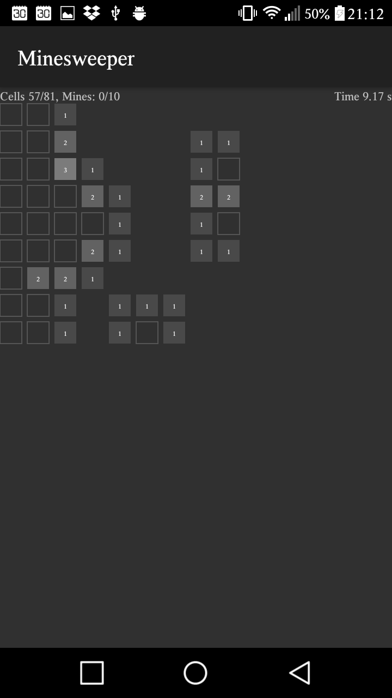

# Minesweeper

Small Minesweeper Project with GUI and a Solver (wip).

## Screenshots

### Desktop Version
[](screenshots/Create_Or_Select.png)
[](screenshots/Current_Game.png)
[](screenshots/Statistics.png)

### Android Version
[](artwork/screenshots/drawer.png)
[](screenshots/Android--Current_Game.png)


## Compiling

### Compiling Desktop GUI
This will create a `core.jar` in `sources/build/libs`

In  directory `sources` run for building:
```
gradle :core:build
```

### Compiling Android

In  directory `sources`:

```
gradle assembleDebug
```


## Directories:
```
.
└── sources
    ├── android
    │   ├── src
    │   │   └── main
    │   │       ├── AndroidManifest.xml
    │   │       ├── java
    │   │       └── res
    │   └── build.gradle
    ├── core
    │   ├── src
    │   │   ├── main
    │   │   │   └── java
    │   │   │       └── nox
    │   │   │           └── minesweeper
    │   │   │               ├── desktop
    │   │   │               └── logic
    │   │   └── test
    │   └── build.gradle
    ├── build.gradle
    └── settings.gradle
```
