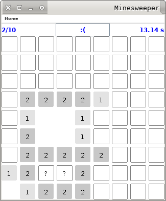

# Minesweeper

Small Minesweeper Project with GUI and a Solver (wip).

## Screenshots





## Directories:
```
.
├── res
│   └── labels.csv
├── src
│   └── nox
│       └── minesweeper
│           ├── Field.java
│           ├── GameField.java
│           ├── LabelsFiller.java
│           ├── Labels.java
│           ├── Minesweeper.java
│           ├── Solver.java
│           ├── PlayGround.java
├── screenshots
```

Where res/labels.csv contains the labels for the gui.


## Compiling
In main directory run for building:
```
make build
```

and for running:
```
make run
```
