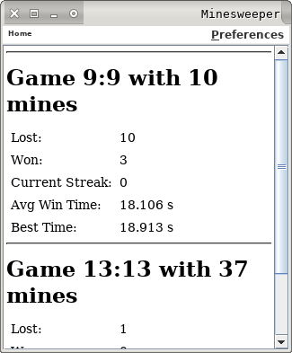

# Minesweeper

Small Minesweeper Project with GUI and a Solver (wip).

## Screenshots

### Desktop Version




### Android Version


## Compiling Desktop GUI
This will create class files in /tmp/Minesweeper

In main directory run for building:
```
make build
```

and for running:
```
make run
```


## Directories:
```
.
├── Makefile
├── AndroidManifest.xml
├── ant.properties
├── build.xml
├── project.properties
├── res
├── screenshots
├── src
│   └── nox
│       └── minesweeper
│           ├── android
│           │   └── ... GUI for Android
│           ├── desktop
|           |   ├── ... Main: Minesweeper
│           │   └── ... GUI and Visible interpretations for the logic 
│           ├── logic
|           |   ├── ... Main: PlayGround
│           │   └── ... *.java field, pausable game, statistics...
│           └── tests
|           |   ├── ... Main: MinesweeperTest
│           │   └── ... *.java (using unittest)
└── todo.txt
```
